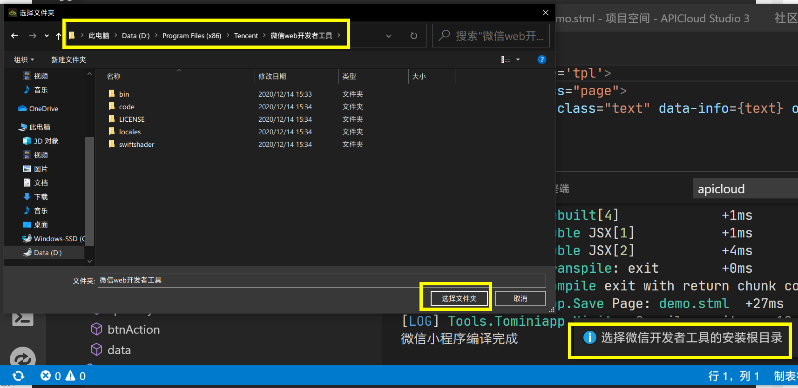
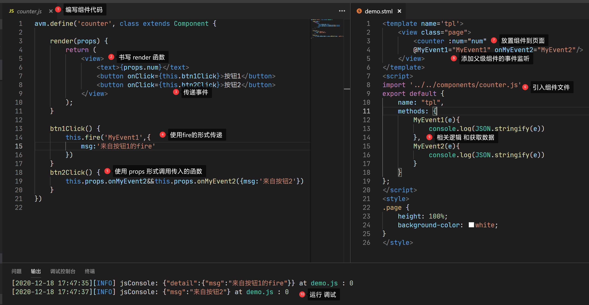

#  APICloud多端开发快速上手教程

## 0 代码仓库
> 如果github图文异常请使用gitee镜像仓库

- [github] https://github.com/apicloudcom/hello-app

- [gitee镜像] https://gitee.com/YangYongAn/hello-app  
## 1 多端技术简介
` APICloud ` 多端技术提供一套代码同时开发原生 ` Android `  &  ` iOS ` 平台的  ` APP  ` 以及小程序的能力。多端技术基于 ` avm.js ` 语法进行代码编写，通过 ` APICloud Studio3 ` 或云编译生成  ` APP  ` 以及小程序代码。

` AVM ` 跨端框架（**A**PICloud-**V**iew-**M**odel)是一个跨端的高性能  ` JavaScript `  框架，更趋近于原生的编程体验。它提供简洁的模型来分离应用的用户界面、业务逻辑和数据模型，适合高度定制化的项目。
## 2  开发工具 APICloud Studio 3

在进行开发之前，需要下载安装 ` APICloud Studio3 ` 工具（下文简称 ` Studio 3  ` ）。 ` Studio 3  `基于  ` VSCODE `  深度定制，通过 ` Studio 3 ` 新建和编写页面并编译预览调试。

[点击进入工具下载页面](https://www.apicloud.com/studio3#downloadBtn/?uzchannel=30)。选择当前系统所对应的版本进行下载安装。更多的详细操作说明可以参[考APICloud Studio 3使用说明](https://docs.apicloud.com/apicloud3/#/overview/devtools?index=0&subIndex=3&uzchannel=30)。

## 3 如何创建第一个应用 HelloApp
### 3.1 创建项目
工具安装完成以后，启动工具，开始点击新建项目。此时需要创建相关应用数据，所以需要登录 ` APICloud ` 账号。如果没有账号则点击立即注册创建一个账号。


完成账号设置后，再次点击创建项目。在页面右侧完善应用基本信息。


#### 3.1.1 关于 ` 选择应用类型 ` 的说明 
 ` APICloud `  3.0 仍然保留了 2.0 的所有技术栈和开发体验，为方便开发者对跨平台技术和多端技术的理解和区分，我们对创建的应用类型进行了明确的区分。

主要包括：

-  **` Native App `**  ： 适合功能强大、性能卓越的  ` App `  开发，
   如果您仅有 ` App `  需求，应选择该模式。
   
-  **` MX App `** ：  适合小程序优先的场景，如果您的业务重点在小程序，而并不介意  ` App ` 侧的功能和体验，应选择该模式。
   开发完的小程序代码，可百分百编译为同等功能的 App，相当于开发一个小程序，“白送”一个  ` App `。
 
-  **` App Clip `** ：即  ` iOS `  轻 ` App `，是苹果公司在  ` iOS ` 14  最新推出的无需下载、即搜即用的全功能 ` App `，属于主 ` App ` 的一部分，可以理解为“苹果小程序”。
详细的场景介绍和技术细节请参考：https://docs.apicloud.com/apicloud3/?uzchannel=30
   
#### 3.1.2 关于 ` 使用AVM.JS ` 的说明
在兼容和继承  ` APICloud `  所有 ` API ` 、模块、技术栈以及用户体验的基础上，我们定义了一套新的代码编写标准（ ` DSL ` ）：

- 基于标准  ` Web Components `  组件化思想，兼容  ` Vue `  /  ` React `  语法特性，通过一次编码，分别编译为  ` App ` 、小程序代码，实现多端开发。

-  ` App `  端使用  ` DeepEngine `  3.0 运行，全翻译式的运行原理提供完全原生的体验和性能。

创建项目完成以后，会自动检出代码。此时弹出一个文件保存位置对话框，选择你想要存放代码位置的文件夹。
检出完成后将会在编辑器中打开项目，代码结构如下：(不同类型的应用文件结构有略微不同，此处以 ` MX App` 类型为例。)

~~~html
┌─css/                  css 样式目录
├─components/           [3.x 版本] 公共组件目录
├─html/                 [2.x 版本] html 页面目录
├─icon/                 应用图标(本地调试用)
├─image/                图片资源目录
├─launch/               启动图片(本地调试用)
├─pages/                [3.x 版本] AVM.js 页面目录 
│  ├─main
│  │  └─main.stml       main.stml 页面代码
├─res/                  原生资源和二进制目录
├─script/               JavaScript 脚本目录
├─wgt/                  子wgt目录
└─config.xml            应用配置文件
~~~
> ` config.xml ` 是应用配置文件，其中定义了应用的基本信息，完整说明请参考：[《config.xml应用配置说明》](https://docs.apicloud.com/Dev-Guide/app-config-manual?uzchannel=30)。


## 4 调试和预览
### 4.1 实时预览

现在开始关注到页面代码，打开 ` page/main/main.stml ` 文件，找到   ` data `  中的 ` text ` 字段，对其进行修改为自己期望的文案。
保存后鼠标右键空白区域，选择“实时预览”。可以在右侧看的刚刚的修改效果。


### 4.2 真机预览

> 实时预览是对项目代码做一个快速的验证和预览，对于一些具体的样式和模块等调试，还是需要使用真机调试。毕竟最后应用是运行在真机设备上的。使用真机预览可以最大程度接近最终生产效果。

#### 4.2.1 使用自定义Loader预览
真机预览需要使用到 ` APPLoader ` ，这里推荐自定义 ` Loader ` 。
首先生成自定义 ` Loader ` 。右键点击项目根目录，选择“编译自定义 ` Loader ` ”，将会打开自定义 ` Loader ` 页面。页面上详细介绍了相关说明。点击左下方绿色按钮，开始编译需要平台的自定义 ` Loader ` 。（ ` iOS ` 端需要设置证书。）


点击后，按钮将变为“正在编译中”，等待项目构建完成，将会出现下载二维码和下载按钮。可以使用设备扫码安装或者点击下载到PC端使用模拟器等安装。


下载安装到设备后，请注意**安卓设备需要打开应用的存储权限**。打开自定义 ` Loader ` ，将会看到右侧有一个半透明小圆球，点击可以输入连接信息。

您可以这样获得连接信息：点击 ` Studio 3 ` 顶部菜单栏的“终端（T）”，选择“连接新设备”，扫码或者输入IP和端口。正常连接成功后，透明小圆球会变成绿色的。


连接成功后，可以使用鼠标右键编辑区域，选择“WiFi实时真机预览”，即可将当前正在编辑的页面传输到真机设备上开始预览。也可以按住  ` Ctrl + i `  快捷键，进行全量同步到设备。

然后可以再做一些修改，再次往复刚刚的操作，进行真机调试预览开发。


#### 4.2.2 使用微信开发者工具预览小程序
> 新的AVM引擎不仅可以编译成 ` APP ` ，还可以编译成小程序。下面的文档介绍了如何编译成小程序，并预览效果。前提是需要[下载安装微信开发者工具](https://developers.weixin.qq.com/miniprogram/dev/devtools/download.html)。


**准备工作**。 需要打开微信开发工具的服务端口。


**接下来编译小程序**。右键项目根目录，选择“编译为小程序【全量】”，稍等一会儿等待日志窗口提示“编译完成”。再次右键根目录，选择“在微信开发者工具中预览”。


**输入小程序的APPID**。此时注意，在编辑器顶部会出现一个输入框，如下图的黄色框。这里是需要输入小程序的APPID，如果没有的话，可以不去修改，暂时按下 ` Enter ` 即可。


**设置开发工具位置**。如果是第一次运行小程序工具来运行，会弹出一个文件对话框，用于选择微信开发工具的安装目录。（可以右键你的微信小程序开发工具，打开文件所在位置，或者查看属性，找到工具安装的具体位置。找到的目录中包含如图  ` bin `   ` code `  这样的文件夹，就是所在的根目录了。）



设置完成后，日志窗口将会输出如下日志，小程序开发工具启动，并开始预览。

```html
正在打开微信开发者工具
- initialize


√ IDE server has started, listening on http://127.0.0.1:51735

- open IDE


√ open IDE
```

## 5 后续操作

当完成这一系列操作，至此你已经可以在你的开发工具、真机设备和微信开发工具上运行起来一个HelloAPP了。后续可以继续参考相关 ` AVM ` 开发文档，进行进一步的编码和业务逻辑设计和开发。

详细的 ` AVM `上手参考本文[《第6节：  AVM 上手》](#s6)

本地调试和预览不需要提交代码到云端，可以直接同步代码和预览。当需要云编译成应用安装包的时候，需要提交代码到云端。

### 5.1 提交代码

提交代码前需要确认是否保存。然后右键点击项目根目录，选择“提交到云端”。


将会出现修改文件列表和输入提交注释的界面。输入注释（也可以使用自己喜欢的代码管理工具进行提交）


调试编写完成以后，提交代码到云端。右键项目根目录，并选择“云编译”，进入打包编译页面，进行一些简单的设置，即可发行你的应用了。


并且进行一些应用设置，点击云编译按钮。稍等片刻打包成功，会显示安装包的下载链接和二维码。


##  <span id=s6> 6 AVM 上手</span>
AVM（APICloud-View-Model）前端组件化开发模式基于标准 ` Web Components ` 组件化思想，提供包含虚拟 ` DOM ` 和 ` Runtime ` 的编程框架 ` avm.js ` 以及多端统一编译工具， 同时兼容 ` Vue ` 和 ` React ` 语法糖编写代码，编译工具将 ` Vue ` 和 ` React ` 相关语法糖编译转换为 ` avm.js ` 代码。

与此同时， ` AVM ` 还兼容APICloud平台现有的所有 [模块](http://www.apicloud.com/modulestore?uzchannel=30)  和 [API](https://docs.apicloud.com/Client-API/api?uzchannel=30) 。

### 6.1 基础组件
> 类似微信小程序一样，基础组件是组件化开发的基石。是一个页面元素和组件的抽象化表达。引擎内置了多个基础组件。

在前面的 ` HelloAPP ` 项目中，我们已经看到了一个文案渲染。其实这就是一个  [ ` Text `  ](https://docs.apicloud.com/apicloud3/#/component/text?index=4&subIndex=1) 文本组件为我们渲染出来的。一个简单的 [ ` Text `  ](https://docs.apicloud.com/apicloud3/#/component/text?index=4&subIndex=1) 组件，在不同的目标系统上会被翻译为对应的平台资源，并且使用原生渲染和响应。在最外层还能看到一个 [ ` View ` ](https://docs.apicloud.com/apicloud3/#/component/view?index=4&subIndex=0) 组件，它就相当于一个组件的容器。可以在其中进行放置和嵌套各种组件，进行页面逻辑组织和编写。

此时我们在页面中再尝试使用另一个基础组件：[ ` Button ` ](https://docs.apicloud.com/apicloud3/#/component/button?index=4&subIndex=4&uzchannel=30)。

依然是在 ` demo ` 页面中，按照[ ` Button ` ](https://docs.apicloud.com/apicloud3/#/component/button?index=4&subIndex=4&uzchannel=30)文档示例代码添加一个[ ` Button ` ](https://docs.apicloud.com/apicloud3/#/component/button?index=4&subIndex=4&uzchannel=30)组件。

在第4行增加以下代码：

```html
    <button onclick={this.btnAction}>默认按钮</button>
```
然后在大约19行的 methods 中添加点击事件的实现。

```js
    btnAction(e) {
        api.alert({ 
            msg: "Hello Click"
        });
    }
```


保存代码，然后预览后可以看到一个按钮。点击后对应逻辑已经执行。

### 6.2 新创建一个页面

当前 ` AVM ` 创建页面的方式有两种，类似  ` Vue ` 的  ` SFC `  模式和类似  ` React `  的单语言模式。

右键点击  ` pages ` 目录，新建一个文件夹命名为 ` sfc `。再右键点击新建好的文件夹 ` sfc `  ，选择“新建stml文件”。在顶部弹出的文件命名框中输入 ` sfc `，确认完成创建新页面。通过此方法创建的文件编辑器将自动初始化一个页面模板。

> **注意**：为了兼容小程序的页面结构，请创建页面的时候，需要在 ` pages ` 目录下建立与页面同名的文件夹，然后再在该文件夹下建立同名的页面文件。 如果你的应用没有小程序编译需求，则可以直接在 ` pages ` 下建立页面，不需要二次文件夹包装。


然后在新建的页面可以组织一些代码：可以尝试类似 ` Vue ` 使用 ` @ ` 符号来绑定一些事件。

```html
<template name='tpl'>
    <view class="page">
        <text>这里是SFC页面</text>
        <button @click="btnAction">按钮</button>
    </view>
</template>
<script>
export default {
    name: "tpl",
    apiready() {
        //like created
    },
    data() {
        return {};
    },
    methods: {
        btnAction() {
            api.toast({
                msg: "使用类似Vue的模式书写组件和绑定事件"
            });
        }
    }
};
</script>
<style>
.page {
    height: 100%;
}
</style>
```


### 6.3 端API对象的能力
> [端API对象](https://docs.apicloud.com/Client-API/api?uzchannel=30) 提供了构建应用程序所需要的一些基本的方法（` Method `） ，如窗口操作、相册和网络数据访问等；以及一些常见的属性 ` Attribute ` ，如屏幕宽度（ ` screenWidth ` ），系统类型（ ` systemType ` ）等；还有一些常用事件（ ` Event ` ），如电量低（ ` batterylow ` ）事件、应用进入后台（ ` pause ` ）事件。

刚刚在介绍页面组织方式的时候，创建了一个新页面。页面间跳转是APP应用程序的基础操作。下面将演示使用端API能力打开新窗口。

将编辑焦点切回到入口文件  ` demo.stml ` 中。 在页面中添加一个按钮用于跳转页面，按钮点击后调用一个函数，其中使用  [` api.openTabLayout `](https://docs.apicloud.com/Client-API/api?uzchannel=30#openTabLayout)  来打开一个新页面。


### <span id=custom-component>6.4 自定义组件</span>
组件化开发的优点在于代码复用和提高维护性。在业务开发过程中，会产生很多的业务组件。例如一个电商APP中的商品列表中的单品显示，或者是不同页面中都会多次使用的一些组件调用。通过基础组件的组合形成更高级的业务组件，修改和维护都会更加方便。

右键项目根目录，新建文件夹，命名为 ` components `。然后开始开发一个组件。

组件的编写方式也可以分为两种，类似  ` Vue ` 的  ` SFC `  模式和类似  ` React `  的单语言模式。

刚刚已经展示了 ` SFC ` 模式。现在介绍组件的时候，可以展示类 ` React `的单语言模式写法。单语言模式是纯 ` JavaScript ` 和  ` JSX ` 来实现的。在一些组件传值和模板逻辑中非常适合使用单语言模式开发。

组件代码如下：

```js
avm.define('counter', class extends Component {

    render(props) {
        return (
            <view>
                <text>{props.num}</text>
                <button onClick={this.btn1Click}>按钮1</button>
                <button onClick={this.btn2Click}>按钮2</button>
            </view>
        );
    }

    btn1Click() {
        this.fire('MyEvent1',{
            msg:'来自按钮1的fire'
        })
    }
    btn2Click() {
        this.props.onMyEvent2&&this.props.onMyEvent2({msg:'来自按钮2'})
    }
})

```

调用组件的父级页面使用组件：

```html
<template name='tpl'>
    <view class="page">
        <counter :num="num" @MyEvent1="MyEvent1" onMyEvent2="MyEvent2"/>
    </view>
</template>
<script>
import '../../components/counter.js'
export default {
    name: "tpl",
    methods: {
        MyEvent1(e){
            console.log(JSON.stringify(e))
        },
        MyEvent2(e){
            console.log(JSON.stringify(e))
        }
    }
};
</script>
<style>
.page {
    height: 100%;
    background-color: white;
}
</style>
```





上面的代码展示了如何定义组件，更多的组件传值和绑定事件，作用域等操作请[参考文档](https://docs.apicloud.com/apicloud3/?uzchannel=30#/components-guide/index?index=5&subIndex=0)。

通过一些基础组件和业务逻辑的组合可以开发出更多利于维护、逻辑统一的业务组件，提升开发效率。

下图展示了一个按钮的组件源码，包括了一些常见的组件封装处理过程，为大家抛砖引玉。

